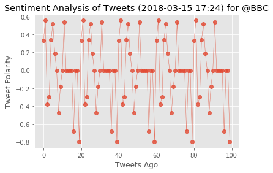
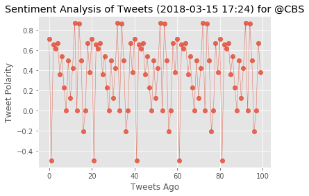
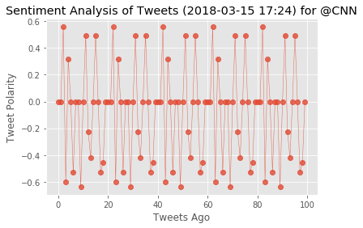
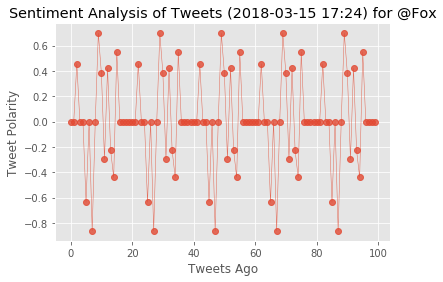
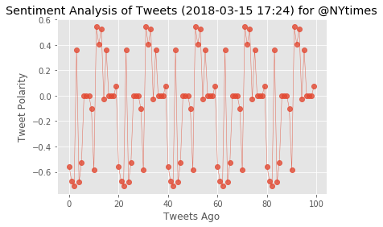

The first plot will be and/or feature the following:

Be a scatter plot of sentiments of the last 100 tweets sent out by each news organization, ranging from -1.0 to 1.0, where a score of 0 expresses a neutral sentiment, -1 the most negative sentiment possible, and +1 the most positive sentiment possible.
Each plot point will reflect the compound sentiment of a tweet.
Sort each plot point by its relative timestamp.
The second plot will be a bar plot visualizing the overall sentiments of the last 100 tweets from each organization. For this plot, you will again aggregate the compound sentiments analyzed by VADER.

The tools of the trade you will need for your task as a data analyst include the following: tweepy, pandas, matplotlib, seaborn, textblob, and VADER.

Your final Jupyter notebook must:

Pull last 100 tweets from each outlet.
Perform a sentiment analysis with the compound, positive, neutral, and negative scoring for each tweet.
Pull into a DataFrame the tweet's source acount, its text, its date, and its compound, positive, neutral, and negative sentiment scores.
Export the data in the DataFrame into a CSV file.
Save PNG images for each plot.
As final considerations:

Use the Matplotlib and Seaborn libraries.
Include a written description of three observable trends based on the data.
Include proper labeling of your plots, including plot titles (with date of analysis) and axes labels.
Include an exported markdown version of your Notebook called  README.md in your GitHub repository.


```python
# Dependencies
import tweepy
import numpy as np
import pandas as pd
from datetime import datetime
import matplotlib.pyplot as plt
from matplotlib import style
style.use('ggplot')

# Import and Initialize Sentiment Analyzer
from vaderSentiment.vaderSentiment import SentimentIntensityAnalyzer
analyzer = SentimentIntensityAnalyzer()

# Twitter API Keys
from config import (consumer_key, 
                    consumer_secret, 
                    access_token, 
                    access_token_secret)

# Setup Tweepy API Authentication
auth = tweepy.OAuthHandler(consumer_key, consumer_secret)
auth.set_access_token(access_token, access_token_secret)
api = tweepy.API(auth, parser=tweepy.parsers.JSONParser())
```


```python
# Target Account
target_user = "@BBC"

# Counter
counter1 = 1

# Variables for holding sentiments
sentiments1 = []

# Loop through 5 pages of tweets (total 100 tweets)
for x in range(5):

    # Get all tweets from home feed
    public_tweets = api.user_timeline(target_user1)

    # Loop through all tweets 
    for tweet in public_tweets:

        #Print Tweets
        #print("Tweet %s: %s" % (counter, tweet["text"]))
        
        # Run Vader Analysis on each tweet
        results = analyzer.polarity_scores(tweet["text"])
        compound1 = results["compound"]
        pos1 = results["pos"]
        neu1 = results["neu"]
        neg1 = results["neg"]
        tweets_ago1 = counter
        
        # Add sentiments for each tweet into an array
        sentiments1.append({"Date": tweet["created_at"], 
                           "Compound": compound1,
                           "Positive": pos1,
                           "Negative": neg1,
                           "Neutral": neu1,
                           "Tweets Ago": counter1})
        
        # Add to counter 
        counter1 = counter1 + 1

```


```python
# Convert sentiments to DataFrame
sentiments1_pd = pd.DataFrame.from_dict(sentiments1)
sentiments1_pd.head()
```


<div>
<style>
    .dataframe thead tr:only-child th {
        text-align: right;
    }

    .dataframe thead th {
        text-align: left;
    }

    .dataframe tbody tr th {
        vertical-align: top;
    }
</style>
<table border="1" class="dataframe">
  <thead>
    <tr style="text-align: right;">
      <th></th>
      <th>Compound</th>
      <th>Date</th>
      <th>Negative</th>
      <th>Neutral</th>
      <th>Positive</th>
      <th>Tweets Ago</th>
    </tr>
  </thead>
  <tbody>
    <tr>
      <th>0</th>
      <td>0.3327</td>
      <td>Thu Mar 15 21:58:00 +0000 2018</td>
      <td>0.000</td>
      <td>0.809</td>
      <td>0.191</td>
      <td>1</td>
    </tr>
    <tr>
      <th>1</th>
      <td>0.5574</td>
      <td>Thu Mar 15 21:04:00 +0000 2018</td>
      <td>0.108</td>
      <td>0.613</td>
      <td>0.278</td>
      <td>2</td>
    </tr>
    <tr>
      <th>2</th>
      <td>-0.3818</td>
      <td>Thu Mar 15 19:30:04 +0000 2018</td>
      <td>0.174</td>
      <td>0.737</td>
      <td>0.089</td>
      <td>3</td>
    </tr>
    <tr>
      <th>3</th>
      <td>-0.2960</td>
      <td>Thu Mar 15 18:30:06 +0000 2018</td>
      <td>0.095</td>
      <td>0.905</td>
      <td>0.000</td>
      <td>4</td>
    </tr>
    <tr>
      <th>4</th>
      <td>0.3400</td>
      <td>Thu Mar 15 17:30:05 +0000 2018</td>
      <td>0.000</td>
      <td>0.882</td>
      <td>0.118</td>
      <td>5</td>
    </tr>
  </tbody>
</table>
</div>


```python
# Create plot
plt.plot(np.arange(len(sentiments1_pd["Compound"])),
         sentiments1_pd["Compound"], marker="o", linewidth=0.5,
         alpha=0.8)

# # Incorporate the other graph properties
now = datetime.now()
now = now.strftime("%Y-%m-%d %H:%M")
plt.title("Sentiment Analysis of Tweets ({}) for {}".format(now, target_user1))
plt.ylabel("Tweet Polarity")
plt.xlabel("Tweets Ago")
plt.show()
```





```python
# Target Account
target_user2 = "@CBS"

# Counter
counter2 = 1

# Variables for holding sentiments
sentiments2 = []

# Loop through 5 pages of tweets (total 100 tweets)
for x in range(5):

    # Get all tweets from home feed
    public_tweets = api.user_timeline(target_user2)

    # Loop through all tweets 
    for tweet in public_tweets:

        #Print Tweets
        #print("Tweet %s: %s" % (counter, tweet["text"]))
        
        # Run Vader Analysis on each tweet
        results = analyzer.polarity_scores(tweet["text"])
        compound2 = results["compound"]
        pos2 = results["pos"]
        neu2 = results["neu"]
        neg2 = results["neg"]
        tweets_ago2 = counter
        
        # Add sentiments for each tweet into an array
        sentiments2.append({"Date": tweet["created_at"], 
                           "Compound": compound2,
                           "Positive": pos2,
                           "Negative": neg2,
                           "Neutral": neu2,
                           "Tweets Ago": counter2})
        
        # Add to counter 
        counter2 = counter2 + 1

sentiments2_pd = pd.DataFrame.from_dict(sentiments2)
sentiments2_pd.head()

# Create plot
plt.plot(np.arange(len(sentiments2_pd["Compound"])),
         sentiments2_pd["Compound"], marker="o", linewidth=0.5,
         alpha=0.8)

# # Incorporate the other graph properties
now = datetime.now()
now = now.strftime("%Y-%m-%d %H:%M")
plt.title("Sentiment Analysis of Tweets ({}) for {}".format(now, target_user2))
plt.ylabel("Tweet Polarity")
plt.xlabel("Tweets Ago")
plt.show()

```





```python
# Target Account
target_user3 = "@CNN"

# Counter
counter3 = 1

# Variables for holding sentiments
sentiments3 = []

# Loop through 5 pages of tweets (total 100 tweets)
for x in range(5):

    # Get all tweets from home feed
    public_tweets = api.user_timeline(target_user3)

    # Loop through all tweets 
    for tweet in public_tweets:

        #Print Tweets
        #print("Tweet %s: %s" % (counter, tweet["text"]))
        
        # Run Vader Analysis on each tweet
        results = analyzer.polarity_scores(tweet["text"])
        compound3 = results["compound"]
        pos3 = results["pos"]
        neu3 = results["neu"]
        neg3 = results["neg"]
        tweets_ago3 = counter
        
        # Add sentiments for each tweet into an array
        sentiments3.append({"Date": tweet["created_at"], 
                           "Compound": compound3,
                           "Positive": pos3,
                           "Negative": neg3,
                           "Neutral": neu3,
                           "Tweets Ago": counter3})
        
        # Add to counter 
        counter3 = counter3 + 1

sentiments3_pd = pd.DataFrame.from_dict(sentiments3)
sentiments3_pd.head()

# Create plot
plt.plot(np.arange(len(sentiments3_pd["Compound"])),
         sentiments3_pd["Compound"], marker="o", linewidth=0.5,
         alpha=0.8)

# # Incorporate the other graph properties
now = datetime.now()
now = now.strftime("%Y-%m-%d %H:%M")
plt.title("Sentiment Analysis of Tweets ({}) for {}".format(now, target_user3))
plt.ylabel("Tweet Polarity")
plt.xlabel("Tweets Ago")
plt.show()
```





```python
# Target Account
target_user4 = "@Fox"

# Counter
counter4 = 1

# Variables for holding sentiments
sentiments4 = []

# Loop through 5 pages of tweets (total 100 tweets)
for x in range(5):

    # Get all tweets from home feed
    public_tweets = api.user_timeline(target_user4)

    # Loop through all tweets 
    for tweet in public_tweets:

        #Print Tweets
        #print("Tweet %s: %s" % (counter, tweet["text"]))
        
        # Run Vader Analysis on each tweet
        results = analyzer.polarity_scores(tweet["text"])
        compound4 = results["compound"]
        pos4 = results["pos"]
        neu4 = results["neu"]
        neg4 = results["neg"]
        tweets_ago4 = counter
        
        # Add sentiments for each tweet into an array
        sentiments4.append({"Date": tweet["created_at"], 
                           "Compound": compound4,
                           "Positive": pos4,
                           "Negative": neg4,
                           "Neutral": neu4,
                           "Tweets Ago": counter4})
        
        # Add to counter 
        counter4 = counter4 + 1

sentiments4_pd = pd.DataFrame.from_dict(sentiments4)
sentiments4_pd.head()

# Create plot
plt.plot(np.arange(len(sentiments4_pd["Compound"])),
         sentiments4_pd["Compound"], marker="o", linewidth=0.5,
         alpha=0.8)

# # Incorporate the other graph properties
now = datetime.now()
now = now.strftime("%Y-%m-%d %H:%M")
plt.title("Sentiment Analysis of Tweets ({}) for {}".format(now, target_user4))
plt.ylabel("Tweet Polarity")
plt.xlabel("Tweets Ago")
plt.show()
```





```python
# Target Account
target_user5 = "@NYtimes"

# Counter
counter5 = 1

# Variables for holding sentiments
sentiments5 = []

# Loop through 5 pages of tweets (total 100 tweets)
for x in range(5):

    # Get all tweets from home feed
    public_tweets = api.user_timeline(target_user5)

    # Loop through all tweets 
    for tweet in public_tweets:

        #Print Tweets
        #print("Tweet %s: %s" % (counter, tweet["text"]))
        
        # Run Vader Analysis on each tweet
        results = analyzer.polarity_scores(tweet["text"])
        compound5 = results["compound"]
        pos5 = results["pos"]
        neu5 = results["neu"]
        neg5 = results["neg"]
        tweets_ago5 = counter
        
        # Add sentiments for each tweet into an array
        sentiments5.append({"Date": tweet["created_at"], 
                           "Compound": compound5,
                           "Positive": pos5,
                           "Negative": neg5,
                           "Neutral": neu5,
                           "Tweets Ago": counter5})
        
        # Add to counter 
        counter5 = counter5 + 1

sentiments5_pd = pd.DataFrame.from_dict(sentiments5)
sentiments5_pd.head()

# Create plot
plt.plot(np.arange(len(sentiments5_pd["Compound"])),
         sentiments5_pd["Compound"], marker="o", linewidth=0.5,
         alpha=0.8)

# # Incorporate the other graph properties
now = datetime.now()
now = now.strftime("%Y-%m-%d %H:%M")
plt.title("Sentiment Analysis of Tweets ({}) for {}".format(now, target_user5))
plt.ylabel("Tweet Polarity")
plt.xlabel("Tweets Ago")
plt.show()
```





## I'm stuck on how to combine all these scatterplots together... 
